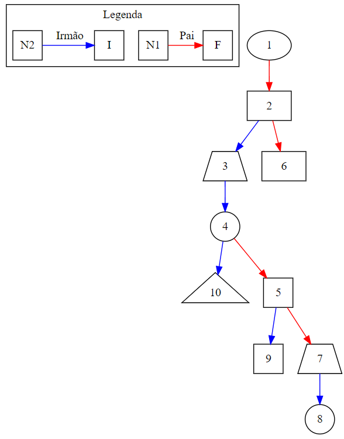
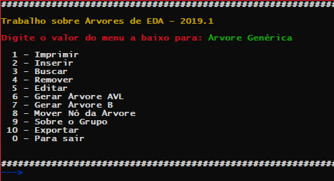
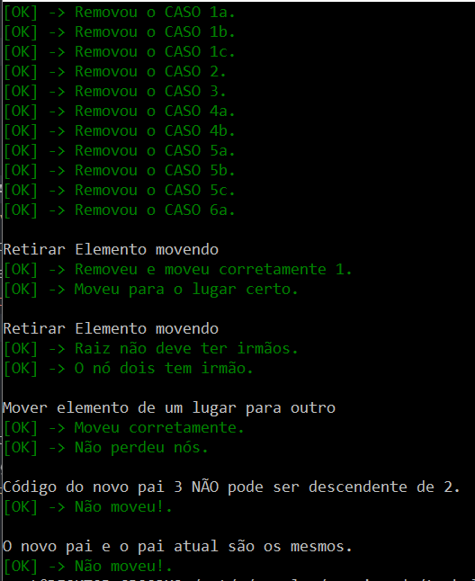
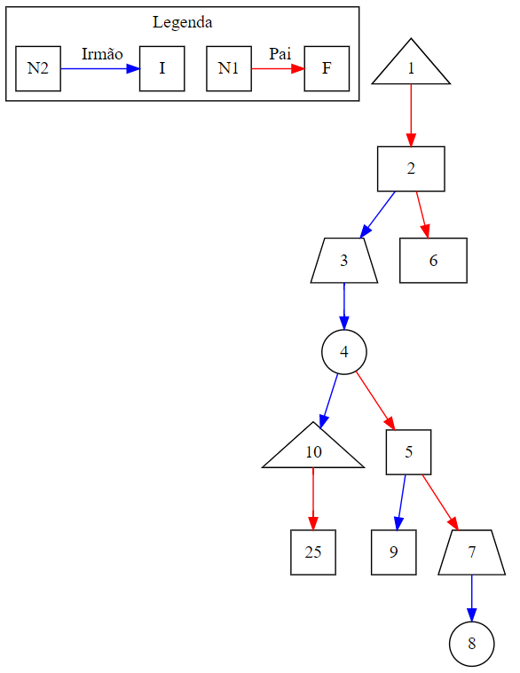
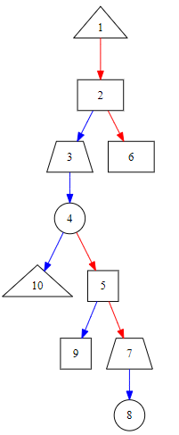
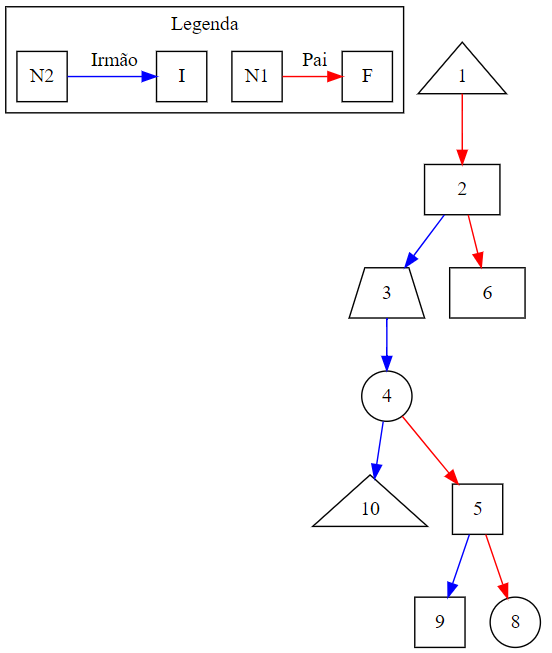
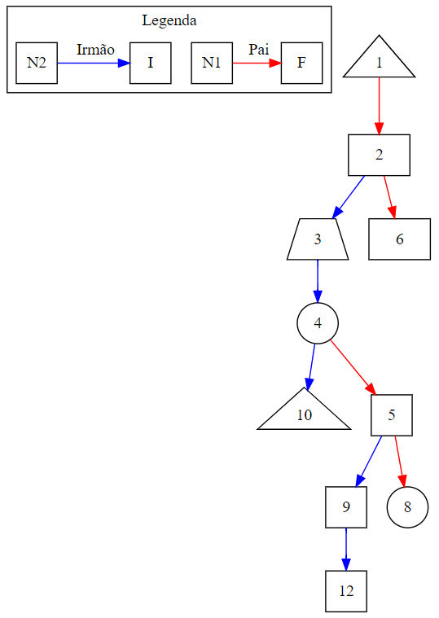
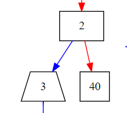
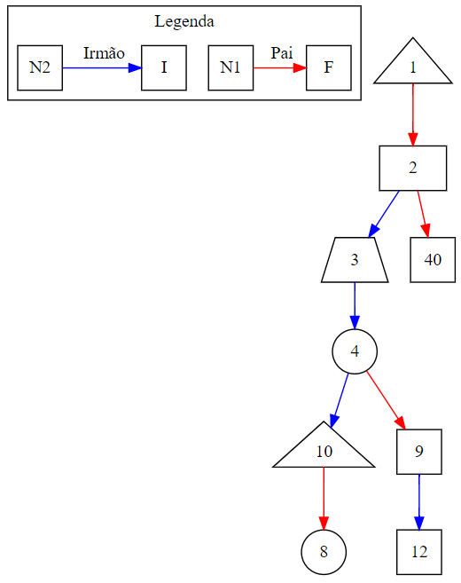
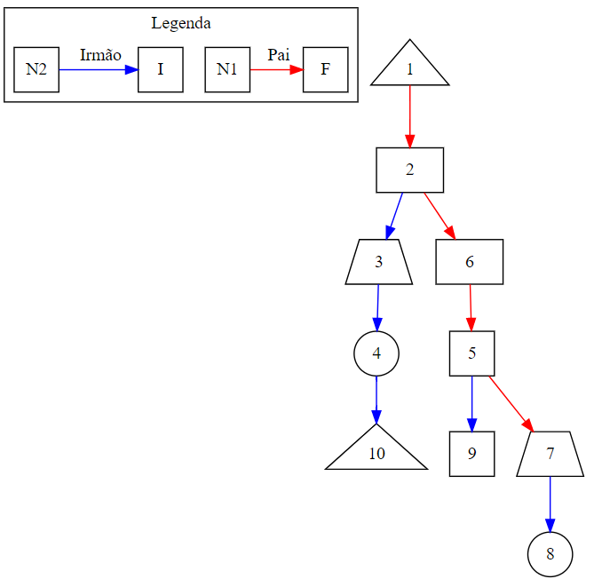

# Trabalho Árvore Genérica

Data da nossa apresentação: 14/06 às 11:50h - G03

## Estrutura de Pastas e Arquivos do Projeto

### :file_folder: Entradas

São arquivos de testes desenvolvidos com o objetivo de testar o projeto.

### :file_folder: Testes

São os arquivos utilizados para a automação dos testes.

* :page_facing_up: **main_testes.c**: esse arquivo executa todos os testes implementados;
* :page_facing_up: **testes.c** e **testes.h**: responsáveis pela programção de cada um dos testes unitários de cada funções do sistema.

### :file_folder: Trabalho

São os arquivos principais do trabalho.

* :page_facing_up: **arbv.c** e **arbv.h**: são os arquivos responsáveis pela implementação da árvore B;
* :page_facing_up: **avl.c** e **avl.h**: são os arquivos responsáveis pela implementação da árvore AVL;
* :page_facing_up: **main.c**: programa principal, trata da importação, menus e chamadas da funções;
* :page_facing_up: **tree.c** e **tree.h**: são os arquivos responsáveis pela implementação da árvore *GENÉRICA*;
* :page_facing_up: **entrada.txt**: esse é o arquivo processado no momento da execução do programa para importar os nós iniciais da árvore genérica.

## Lógica da Árvore Genérica

Cada nó da árvore é do tipo TAG (Tipo Árvore Geométrica/Genérica). Esse nó é composto por dois campos principais, f e i. O campo f aponta para os filhos do nó, já o campo i aponta para os nós irmãos.

Sendo assim, em última instância uma árvore genérica pode ser considerada uma árvore binária com uma regra de formação onde, os filhos de um nó estão organizados da seguinte maneira.

* O primeiro filho sempre está no ponteiro f;
* O próximo irmão sempre está no ponteiro i;

Assim, para navegar por todos os filhos de um nó X temos que primeiro acessar o ponteiro de x para f (x->f) e, em seguida navegar por (x->f->i) ou seja, todos os irmãos do primeiro filho.

Uma visualização da árvore genérica pode ser vista na imagem abaixo.

<center>
  <strong>Figura 1</strong>
</center>



Na imagem acima, uma seta azul indica uma relação de irmandade entre os nós, já uma seta vermelha indica uma relação de paternidade entre os nós.

Um nó da árvore genérica é formado pelo arranjo de três *structs*. Essa organização permite que um nó possa armazenar dados de figuras geométricas distintas, bem como suas dimensões. As *structs* estão definidas no arquivo **tree.h** sendo elas:

* TQUADRADO / TTRIANGULO / TCIRCULO / TRETANGULO / TTRAPEZIO: contém as dimensões de cada uma das figuras geométricas;
* TDADO: armazena o tipo da figura, bem como o ponteiro para a figura além da área da figura;
* TAG: nó autocontido em i (ponteiro para irmãos) e f (ponteiro para filhos), além do **cod** que é o identificados único da figura dentro da árvore e do TDADO que aponta para os ponteiros da figura.

A impressão de um nó em particular nos traz uma visão geral sobre a sua estrutura e a dos seus filhos. Abaixo temos a impressão do nó 1 da árvore genérica da imagem acima.

```
+-------------------------------------------------+
| Cod               : 1
| Tipo              : Triângulo
| Dimensões         : B: 3.00, A: 2.00
| N. Filhos         : 4
| N. Descendentes   : 9
| Área do Nó        : 3.00
| Área Descendentes : 101.30
| Área Total        : 104.30
| Área Apenas Filhos: 70.24
+-------------------------------------------------+
```

Os campos da impressão do nós são os seguintes:

* **Cod**: é o código único de um elemento dentro da árvore;
* **Tipo**: É o nome do tipo da imagem que está armazenada naquele nó;
* **Dimensões**: Para cada tipo de dado as informações exibidas serão distintas;
* **N. Filhos**: Representa o número de filhos que o nó possui;
* **N. Descendentes**: É a soma de todos os nós que descentem diretamente dele. São seus filhos, netos, bisnetos e por ai vai!
* **Área do Nó**: representa a área da figura geométrica que está contida no nó. É calculado no momento da inserção do nó e também nas futuras atualizações que a figura pode sofrer;
* **Área Descendentes**: é a soma das áreas de todos os descendentes do nó;
* **Área Total**: é a soma das áreas de todos os descendentes do nó somado com a área do próprio nó;
* **Área Apenas Filhos**: é a soma das áreas de todos os filhos que o nó possui.

## Como Compilar o Trabalho

Para compilar o trabalho é necessário linkar todas as bibliotecas utilizadas na sua elaboração. A linha de comando abaixo deve ser executada dentro da pasta **trabalho**.

É necessário rodar com o testes.c para poder executar o 51 e ver o resultado dos testes:

```
gcc -o prog main.c tree.c avl.c arvb.c ../testes/testes.c
```

Para rodar o programa após a sua compilação basta executar:

```
./prog
```

O resultado da execução do programa deve ser uma tela semelhante à representada na figura abaixo.

<center>
  <strong>Figura 2</strong>
</center>
<hr/>

<hr/>

## Casos de Teste

Para executar uma bateria de testes pré-programados, acesse a pasta **testes** e compile o programa de testes, conforme linha de comando abaixo.

```gcc -o prog main_testes.c ../trabalho/tree.c ../trabalho/avl.c testes.c ../trabalho/arvb.c```

Para rodar o programa após a sua compilação basta executar:

```
./prog
```
O resultado da execução dos casos de teste deve ser uma tela semelhante à representada através da figura abaixo.

<center>
  <strong>Figura 3</strong>
</center>
<hr/>

<hr/>

## Explicação das Funcionalidades do Trabalho

Os ítens do menu principal do programa são:

```
1 - Imprimir: possui várias modalidades de exibição da árvores, sendo elas: formato hierárquico; formato de árvore binária; formato DOT; impressão dos dados de um único nó e seus filhos;
2 - Inserir: permite que uma nova figura seja inserida na árvore;
3 - Buscar: permite que a partir do código **cod** de uma figura, seja possível encontrar um nó na árvore;
4 - Remover: permite que a partir de um código **cod** seja removido um nó da árvore. Em linhas gerais, a remoção de elementos que tenham filhos e irmãos depende da interação do usuário para definir onde os filhos serão alocados. Caso tenha apenas filhos, então eles são alocados automaticamente para o pai do nó que está sendo removido.
5 - Editar: permite que os dados de um deteminado nó sejam alterados;
6 - Gerar Árvore AVL: converte a *arvore genérica* em uma árvore *AVL*.
7 - Gerar Árvore B: converte a *arvore genérica* em uma árvore *B*.
8 - Mover Nó da Árvore: permite que um nó (e seus descendentes) sejam movidos para outro pai;
9 - Sobre o Grupo: quem fez o trabalho, e deu trabalho pra caramba!!!! :P ;
10 - Exportar: gera, a partir da árvore genérica em memória, uma string igual a utilizada pelo arquivo de importação;
0 - Para sair: antes de sair do programa é dado um *free* em cada um dos nós da árvore genérica.
```

### :card_index: Menu :one: Imprimir

O menu imprimir é composto por 4 opções, sendo elas:

```
1 - Para Impressão de status de um nó
2 - Para Impressão da árvore completa (formato hierárquico)
3 - Para Impressão da árvore generica
4 - Para Gerar DOT para impressão externa (extra)
0 - Para retornar
```

#### Menu :one: Para Impressão de status de um nó

Esse menu solicita que o usuário digite o **cod** do nó que ele está interessado em recuperar informações. Caso o **cod** digitado não exista na árvore, será exibida uma mensasgem de erro. Caso o **cod** esteja na árvore, então será exibido o status do nó e dos seus filhos. Caso seja impresso o nó **5** com base na *Figura 1* teremos o seguinte resultado:

```
===> PAI
+-------------------------------------------------+
| Cod               : 5
| Tipo              : Quadrado
| Dimensões         : L: 3.00
| N. Filhos         : 2
| N. Descendentes   : 2
| Área do Nó        : 9.00
| Área Descendentes : 17.06
| Área Total        : 26.06
| Área Apenas Filhos: 17.06
+-------------------------------------------------+

===> Filho (1)

+-------------------------------------------------+
| Cod               : 7
| Tipo              : Trapézio
| Dimensões         : B1: 1.00, B2: 2.00, A: 3.00
| N. Filhos         : 0
| N. Descendentes   : 0
| Área do Nó        : 4.50
| Área Descendentes : 0.00
| Área Total        : 4.50
| Área Apenas Filhos: 0.00
+-------------------------------------------------+

===> Filho (2)

+-------------------------------------------------+
| Cod               : 8
| Tipo              : Círculo
| Dimensões         : R: 2.00
| N. Filhos         : 0
| N. Descendentes   : 0
| Área do Nó        : 12.56
| Área Descendentes : 0.00
| Área Total        : 12.56
| Área Apenas Filhos: 0.00
+-------------------------------------------------+
```

Neste caso, o nó possui dois filhos que são o 7 e o 9 e estes nós não possuem filhos.

#### Menu :two: Para Impressão da árvore completa (formato hierárquico)

Esse tipo de impressão permite que seja visualizada todos os nós da árvore bem como a relação de parentesco entre eles. Esse tipo de exibição é adotada em outras partes do sistema, como por exemplo no remover e no mover onde é necessário que outro nó seja escolhido.

```
Árvore Completa
----------------
-> 1 (Triângulo,3.00)
---> 2 (Retângulo,9.00)
-----> 6 (Retângulo,9.00)
---> 3 (Trapézio,3.00)
---> 4 (Círculo,50.24)
-----> 5 (Quadrado,9.00)
-------> 7 (Trapézio,9.00)
-------> 8 (Círculo,9.00)
-----> 9 (Quadrado,50.24)
---> 10 (Triângulo,3.00)
----------------
Total de nós: 10
----------------
```

#### Menu :three: Para Impressão da árvore generica

Esse tipo de impressão deve ser lida da seguinte forma: nós que possuem a mesma distância da margem esquerda da tela estão no mesmo nível hierárquico (não respeitando a relação de parentesco).

```
------->6
---->2
------->3
---------------->7
------------------->8
------------->5
---------------->9
---------->4
------------->10
->1
```

É interessante notar o desbalanceamento natural da árvore genérica, o que torna a recuperação de uma informação em seu interior mais custosa.

#### Menu :four: Para Gerar DOT para impressão externa (extra)

A fim de facilitar o processo de visualização da árvore genérica, criamos um mecanismo para exportar a árvore em formado string no formato DOT. O formado DOT é um padrão descritivo de imagens que permite a geração de imagens como a **Figura 1**.

Existe um visualizador web http://www.webgraphviz.com/ que pode ser usado para converter a string em formado DOT para uma imagem. Abaixo um trecho da string DOT da **Figura 1**

```
digraph  G {
  1[shape=triangle]
  2[shape=rect]
  1 -> 2  [color="red"];
  3[shape=trapezium]
  2 -> 3  [color="blue"];
  4[shape=circle]
  3 -> 4  [color="blue"];
  10[shape=triangle]
  4 -> 10  [color="blue"];
  5[shape=square]
  4 -> 5  [color="red"];
  9[shape=square]
  5 -> 9  [color="blue"];
  7[shape=trapezium]
  5 -> 7  [color="red"];
  8[shape=circle]
  7 -> 8  [color="blue"];
  6[shape=rect]
  2 -> 6  [color="red"];
}
```

É importante destacar que as setas de cor <em style="color:blue">
azul</em> indicam relação de irmandade, enquanto as setas de cor <em style="color:red"> vermelha</em> indicam relação de paternidade.


Nessa imagem podemos ver que 2, 3, 4 e 10 são filhos de 1. A seta de 1 para 2 é vermelha, pois ele é o primeiro filho de 1. Os demais filhos de 1 tem no ponteiro filho o próximo filho de 1. "ideia espertinha essa não?!".

```diff
+ Para ficar ainda mais legal a exibição da árvore, adotamos a estratégia de colocar no formato
+ do nó refletindo a figura geométrica que está armazenada nele! Então o
+ nó 3 tem formato de trapézio pois ele é um trapézio! ;)
```

### :arrow_right: Menu :two: Inserir

O menu inserir permite que novas figuras sejam inseridas na árvore genérica. Lembrando que em toda manipulação que é feita na árvore genérica, a AVL e a B são **novamente** geradas.

Os itens do menu inserir são:
```
1 - Para Inserir um Quadrado
2 - Para Inserir um Círculo
3 - Para Inserir um Retângulo
4 - Para Inserir um Triângulo
5 - Para Inserir um Trapézio
0 - Para retornar
```

Todas as opções tem o mesmo funcionamento. Primeiro o usuário precisa escolher qual figura ele quer inserir, em seguida ele deve informar o código do nó que será o pai da nova figura e, por fim, preencher os dados necessários para criar cada uma das figuras geométricas.

Caso o usuário digite o código de um pai que não existe é exibida uma mensagem de alerta. Após a inserção de uma nova figura, são exibidas as informações do nó PAI e as informações do nó da nova figura. Por exemplo, caso seja inserido um quadrado com cod 25 e lado 25 e cujo pai é o nó 10 teremos a seguinte saida:

```
===> PAI
+-------------------------------------------------+
| Cod               : 10
| Tipo              : Triângulo
| Dimensões         : B: 1.00, A: 2.00
| N. Filhos         : 1
| N. Descendentes   : 1
| Área do Nó        : 1.00
| Área Descendentes : 625.00
| Área Total        : 626.00
| Área Apenas Filhos: 625.00
+-------------------------------------------------+

===> Filho (1)

+-------------------------------------------------+
| Cod               : 25
| Tipo              : Quadrado
| Dimensões         : L: 25.00
| N. Filhos         : 0
| N. Descendentes   : 0
| Área do Nó        : 625.00
| Área Descendentes : 0.00
| Área Total        : 625.00
| Área Apenas Filhos: 0.00
+-------------------------------------------------+
```

Lembrando que o nó 10 não tinha filhos, portanto, o nó 25 será o primeiro filho do nó 10. Podemos ver este comportamento representado na figura abaixo:

<hr/>

<hr/>

### :mag: Menu :three: Buscar

Esse menu permite que sejam realizadas buscas dentro da árvore genérica. As buscas podem ser relizadas pelo código ou pelo tipo da figura desejada.

#### Menu :one: Busca por código

A busca é feita através do **cod** do nó. Caso o **cod** não esteja na árvore, é retornada uma mensagem de erro. No código fonte foram implementadas duas buscas: uma recursiva e a outra interativa/recursiva. Ambas retornam o mesmo resultado e optamos por deixar a função recursiva como padrão.

O resultado pela busca do nó com **cod** igual a 25 é a seguinte:

```
Digite o Código da Busca:
---> 25

+-------------------------------------------------+
| Cod               : 25
| Tipo              : Quadrado
| Dimensões         : L: 25.00
| N. Filhos         : 0
| N. Descendentes   : 0
| Área do Nó        : 625.00
| Área Descendentes : 0.00
| Área Total        : 625.00
| Área Apenas Filhos: 0.00
+-------------------------------------------------+
```

#### Menu :two: Busca por tipo de figura

A busca é feita informando qual o tipo de figura geométrica você gostaria de localizar. Basta escolher um dos tipo que serão listados todos os nós com aquele tipo juntamente com seu código e área, ao final, será exibida a soma de todas as áreas das figuras.

```
Códigos dos Tipos
--------------------
1 - Quadrado
2 - Círculo
3 - Retângulo
4 - Triângulo
5 - Trapézio
--------------------

Digite o Código do Tipo:
---> 5

Todos os nós com o tipo Trapézio.
--------
Cód: 3 Área: 10.00
--------
Cód: 7 Área: 4.50
============
Área Total: 14.50
```

### :no_entry: Menu :four: Remover

Permite que a partir de um código **cod** seja removido um nó da árvore. Em linhas gerais, a remoção de elementos que tenham filhos e irmãos depende da interação do usuário para definir onde os filhos serão alocados. Caso o nó tenha apenas filhos, então eles são alocados automaticamente para o pai do nó que está sendo removido.

```diff
- Garantimos que o nó raiz não pode ser removido! ;)
```

Abaixo serão executados diversos testes de remoção. A mesma árvore será usada em todos os testes e a próxima remoção será realizada com base na anterior.

#### Caso 1: o nó não tem nem filho nem irmão.

Esse é o caso é o mais simples. Por exemplo: supondo que o nó removido seja o 25, se removermos ele, o que será feito é setar como NULL o ponteiro f do nó 10.

O resultado dessa remoção pode ser visto abaixo.

<hr/>

<hr/>

#### Caso 2: o nó não tem filhos mas tem irmão.

Esse é o caso do nó 7. Se removermos o nó 7 terá que ser alterado o ponteiro filho do nó 5 (que é o pai de 7) para o irmão de 7 que é o 8.

O resultado dessa remoção pode ser visto abaixo.

<hr/>

<hr/>

A situação é um pouco diferente caso o nó removido não seja o primeiro filho, mas um dos filhos intermediários ou até mesmo o último filho. Nesse caso, o que deve ser alterado é o ponteiro *i* do irmão anterior para que este aponte para o irmão do nó que será removido.

Para implementar esse caso, vamos inserir em nossa árvore dois novos nós, o pai desses elementos serão o nó 4. Os elementos 11 e 12 serão inseridos, assim, os filhos de 4 serão 5->9->11->12 e em seguida iremos remover o nó 11. Sendo assim o nó que sofrerá a alteração em seus ponteiros será o nó 9 cujo irmão agora não mais será o 11 mas sim o 12.

<hr/>

<hr/>

#### Caso 3: o nó tem filhos mas não tem irmão.

Nesse cenário adotamos uma estratégia automática de posicionamento dos descendentes do elemento que está sendo removido. Para testar esse caso vamos inserir um filho para o nó 6, esse filho terá o **cod** 40.

Nesse cenário, optamos por realizar a seguinte operação: o filho de 6 será alocado como filho do seu pai, ou seja, o avô está cuidando do neto. Caso o avô não tenha outros filhos, então o ponteiro f do pai apontará pra o filho do nó que está sendo removido. Caso o pai já tenha filhos, então o filho do nó que está sendo removido será inserido dentro do último filho do nó pai.

Ou seja, se removermos o nó 6 da figura anterior o nó 40 irá entrar como nó irmão de 10. Caso seja removido o nó 6 então ele será alocado como o primeiro filho de 2, conforme representado na figura abaixo:

<hr/>

<hr/>


#### Caso 4, o nó tem filhos e tem irmão.

Por fim chegamos ao caso mais complexo onde o nó removido tem filhos e irmãos! Nesse caso, o usuário terá que escolher qual será o novo nó pai do nó removido. Vale ressaltar que o novo nó pai **NÃO** pode ser um descendente do nó que está sendo removido!

Com base na figura anterior, vamos remover o nó 5. Nesse caso teremos que optar por colocar o nó 5 em outro nó que não seja seu descendente. Nesse caso temos várias opções, sendo elas:

```
O novo pai pode ser um dos nós abaixo
-> 1 (Triângulo,3.00)
---> 2 (Retângulo,9.00)
-----> 40 (Quadrado,9.00)
---> 3 (Trapézio,3.00)
---> 4 (Círculo,50.24)
---> 10 (Triângulo,3.00)
```

A informação representada acima é gerada automaticamente pelo sistema para ajudar o usuário a escolher qual será o novo nó pai do nó 5. Observe que não estão sendo exibidos nem o 5 nem nenhum de seus descendentes. Para dar andamento, vamos supor que o novo nó pai dos filhos será o nó 10. Sendo assim, o resultado da nossa remoção pode ser visto na figura abaixo:

<hr/>

<hr/>

### :pencil: Menu :five: Editar

Permite que os dados de um deteminado nó sejam alterados. O código do nó não pode ser alterado e os dados que podem ser modificados são: tipo da figura e as suas informações.

Vamos supor que queremos modificar o nó cujo **cod** é igual a 10. Ao solicitar a edição, será solicitado que o usuário escolha a nova figura geométrica que será associada ao nó 10.

```
Digite o Código da Busca:
---> 10

+-------------------------------------------------+
| Cod               : 10
| Tipo              : Triângulo
| Dimensões         : B: 1.00, A: 2.00
| N. Filhos         : 0
| N. Descendentes   : 0
| Área do Nó        : 1.00
| Área Descendentes : 0.00
| Área Total        : 1.00
| Área Apenas Filhos: 0.00
+-------------------------------------------------+

Escolha uma das opções

1 - Alterar para um Quadrado
2 - Alterar para um Círculo
3 - Alterar para um Retângulo
4 - Alterar para um Triângulo
5 - Alterar para um Trapézio
0 - Para retornar

---> 1

Digite o Lado do Quadrado:
---> 58

===> PAI
+-------------------------------------------------+
| Cod               : 10
| Tipo              : Quadrado
| Dimensões         : L: 58.00
| N. Filhos         : 0
| N. Descendentes   : 0
| Área do Nó        : 3364.00
| Área Descendentes : 0.00
| Área Total        : 3364.00
| Área Apenas Filhos: 0.00
+-------------------------------------------------+

```

O nó 10, que era um triângulo, agora é um quadrado cujo lado é igual a 58 e sua área é igual a 3364.00.


### :evergreen_tree: Menu :six: Gerar Árvore AVL

Converte a *arvore genérica* em uma árvore *AVL*. Esse processo é feito a partir de um caminhamento em largura pela árvore genérica. Para cada nó encontrado, ele é inserido na árvore AVL. Além do **cod**, também é inserido um ponteiro para o nó da árvore genérica.

### :deciduous_tree: Menu :seven: Gerar Árvore B

Converte a *arvore genérica* em uma árvore *B*. Esse processo é feito a partir de um caminhamento em largura pela árvore genérica. Para cada nó encontrado, ele é inserido na árvore B. Além do **cod**, também é inserido um ponteiro para o nó da árvore genérica.

### :truck: Menu :eight: Mover

Permite que um nó (e seus descendentes) seja movido para outro pai. Tomando como referência o **Figura 1**, podemos mover o nó 5, que é filho de 4, para o nó 6. Nesse caso, a árvore resultante pode ser vista na imagem abaixo. Aqui enfrentamos a mesma restrição de destino do nó em relação aos seus descendentes, ou seja, o nó só pode ser movido para um outro nó que tenha como antecessor o nó movido .

```
Digite o Código do Nó a ser Movido:
---> 5

O novo pai pode ser um dos nós abaixo
-> 1 (Triângulo,3.00)
---> 2 (Retângulo,9.00)
-----> 6 (Retângulo,9.00)
---> 3 (Trapézio,3.00)
---> 4 (Círculo,50.24)
---> 10 (Triângulo,3.00)
------------

Digite o Código do Novo Pai:6
```

<hr/>

<hr/>


### :100: Menu :nine: Sobre

Integrantes do grupo:

* Andre Montevecchi
* Anselmo Battisti
* Flávio Miranda de Farias

### :door: Menu :zero: Sair

Antes de sair do programa é dado um *free* em cada um dos nós da árvore genérica.

### :ship: Menu Exportar

Gera uma string de saída no mesmo formado do arquivo de entrada. A string é gerada com base na árvore que está na memória do programa.

### :egg: Menu "51 Easter Egg" Casos de teste

Executa todos os casos de teste do sistema.

## O que podemos fazer para melhorar

* busca por tipo e por tamanho das figuras, hoje só tem por código
* colocar dentro da árvore B o ponteiro para o nó da árvore genérica (não sei se ela espera isso, pq na árvore AVL foi implementado)
* ordenar as figuras por tamanho ou ainda por tipo
* fazer um relatório do tipo 10% das figuras são círculos (bi de imagens)

## Descrição do Trabalho

Trabalho Computacional: implementação das funções de árvores genéricas no número de filhos, árvores n-árias, e no tipo de informação armazenada, testando com as seguintes figuras geométricas: círculo, quadrado, retângulo, trapézio e triângulo: deve ser permitido ao usuário do sistema:

* 1  - OK (a) buscar figuras geométricas, por meio de um código único;
* 2  - OK (b) imprimir informações relevantes, tanto da árvore, quanto das figuras, incluindo-se sua área;
* 3  - OK (c) inserir novas figuras;
* 4  - OK (d) retirar figuras, passando seus descendentes para outro pai;
* 5  - OK (e) destruir a árvore;
* 6  - OK (f) alterar as dimensões de figuras;
* 7  - OK transformar a árvore genérica numa árvore binária de busca balanceada, baseando-se no código único;
* 8  - OK Converter a árvore genérica numa árvore B, baseando-se no código único;
* 9  - OK a entrada será fornecida por meio de arquivos texto. O arquivo texto será composto das seguintes informações, separadas por '/': código único, código único do pai (sendo que a raiz tem código do pai igual a zero) e as figuras geométricas, incluindo seu nome;
* 10 - OK as dimensões das figuras geométricas obedecerão ao seguinte padrão: (a) se a figura for um círculo ou um quadrado, uma única dimensão será informada (ou o raio, ou o lado, respectivamente); (b) se a figura for um triângulo ou um retângulo, as duas dimensões informadas serão a base e a altura; e, por fim, (c) se a figura for um trapézio, três dimensões serão informadas, nessa ordem, base menor, base maior e altura;
* 11 - OK exemplo de arquivo fornecido. PORÉM, SEU CÓDIGO DEVE FUNCIONAR COM QUALQUER ENTRADA QUE SEGUE O PADRÃO SUPRACITADO;
* 12 - OK A estrutura deve ser totalmente destruída pelo seu programa antes da execução ser finalizada;
