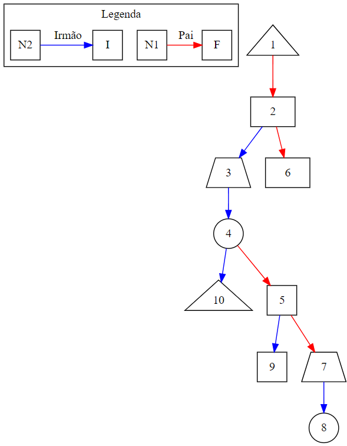

# Trabalho Árvore Genérica

## Estrutura de Pastas e Arquivos do Projeto

### :file_folder: Entradas

São arquivos de testes desenvolvidos com o objetivo de testar o projeto.

### :file_folder: Testes

São os arquivos utilizados para a automação dos testes.

* :page_facing_up: **main_testes.c**: esse arquivo executa todos os testes implementados;
* :page_facing_up: **testes.c** e **testes.h**: responsáveis pela programção de cada um dos testes unitários de cada funções do sistema.

### :file_folder: Trabalho

São os arquivos principais do trabalho.

* :page_facing_up: **arbv.c** e **arbv.h**: são os arquivos responsáveis pela implementação da árvore B;
* :page_facing_up: **avl.c** e **avl.h**: são os arquivos responsáveis pela implementação da árvore AVL;
* :page_facing_up: **main.c**: programa principal, trata da importação, menus e chamadas da funções;
* :page_facing_up: **tree.c** e **tree.h**: são os arquivos responsáveis pela implementação da árvore *GENÉRICA*;
* :page_facing_up: **entrada.txt**: esse é o arquivo processado no momento da execução do programa para importar os nós iniciais da árvore genérica.

## Lógica da Árvore Genérica

Cada nó da árvore é do tipo TAG (Tipo Árvore Geométrica/Genérica). Esse nó é composto por dois campos principais, f e i. O campo f aponta para os filhos do nó, já o compo i aponta para os nós irmãos.

Sendo assim, em última instância uma árvore genérica pode ser considerada uma árvore binária com uma regra de formação onde, os filhos de um nó estão organizados da seguinte maneira.

* O primeiro filho sempre está no ponteiro f;
* O próximo irmão sempre está no ponteiro i;

Assim, para navegar por todos os filhos de um nó X temos que primeiro acessar o ponteiro de x para f (x->f) e, em seguida navegar por (x->f->i) ou seja, todos os irmãos do primeiro filho.

Uma visualização da árvore genérica pode ser vista na imagem abaixo.



Na imagem acima, uma seta azul indica uma relação de irmandade entre os nós, já uma seta vermelha indica uma relação de paternidade entre os nós.

Um nó da árvore genérica é formado pelo arranjo de três *structs*. Essa organização permite que um nó possa armazenar dados de figuras geométricas distintas, bem como suas dimensões. As *structs* estão definidas no araquivo **tree.h** sendo elas:

* TQUADRADO / TTRIANGULO / TCIRCULO / TRETANGULO / TTRAPEZIO: contém as dimensões de cada uma das figuras geométricas;
* TDADO: armazena o tipo da figura bem como o ponteiro para a figura além da área da figura;
* TAG: nó autocontido em i (ponteiro para irmãos) e f (ponteiro para filhos), além do **cod** que é o identificados único da figura dentro da árvore e do TDADO que aponta para os ponteiros da figura.

A impressão de um nó em particular nos traz uma visão geral sobre a sua estrutura e a dos seus filhos. Abaixo temos a impressão do nó 1 da árvore genérica da imagem acima.

```
+-------------------------------------------------+
| Cod               : 1
| Tipo              : Triângulo
| Dimensões         : B: 3.00, A: 2.00
| N. Filhos         : 4
| N. Descendentes   : 9
| Área do Nó        : 3.00
| Área Descendentes : 101.30
| Área Total        : 104.30
| Área Apenas Filhos: 70.24
+-------------------------------------------------+
```

Os campos da impressão do nós são os seguintes:

* **Cod**: é o código único de um elemento dentro da árvore;
* **Tipo**: É o nome do tipo da imagem que está armazenada naquele nó;
* **Dimensões**: Para cada tipo de dado as informações exibidas ~serão distintas;
* **N. Filhos**: Representa o número de filhos que o nó possui;
* **N. Descendentes**: É a soma de todos os nós que descentem diretamente dele. São seus filhos, netos, bisnetos e por ai vai!
* **Área do Nó**: representa a área da figura geométrica que está contida no nó. É calculado no momento da inserção do nó e também nas futuras atualizações que a figura pode sofrer;
* **Área Descendentes**: é a soma das áreas de todos os descendentes do nó;
* **Área Total**: é a soma das áreas de todos os descendentes do nó somado com a área do próprio nó;
* **Área Apenas Filhos**: é a soma das áreas de todos os filhos que o nó possui.

## Como Compilar o Trabalho

Para compilar o trabalho é necessário linkar todas as bibliotecas utilizadas na sua elaboração. A linha de comando abaixo deve ser executada dentro da pasta **trabalho**.

```
gcc -o prog main.c tree.c avl.c arvb.c
```

Para rodar o programa após a sua compilação basta executar

```
./prog
```

O resultado da execução do programa deve ser uma tela mais ou menos como a da imagem abaixo.


## Casos de Teste

Para executar uma bateria de testes pré-programado acesse a pasta **testes** e compile o programa de testes.

```gcc -o prog main_testes.c ../trabalho/tree.c ../trabalho/avl.c testes.c ../trabalho/arvb.c```

Para rodar o programa após a sua compilação basta executar

```
./prog
```
O resultado da execução dos casos de teste deve ser uma tela mais ou menos como a da imagem abaixo.


## Explicação das Funcionalidades do Trabalho

Os itens do menu principal do programa são:

1 - Imprimir: possui várias modalidades de exibição da árvores, sendo ela: formato hierárquico; formato de árvore binário; formato DOT; impressão dos dados de um único nó e seus filhos;
2 - Inserir: permite que uma nova figura seja inserida na árvore;
3 - Buscar: permite que a partir do código **cod** de uma figura seja possível encontrar um nó na árvore;
4 - Remover: permite que a partir de um código **cod** seja removido um nó da árvore. Em linhas gerais a remoção de elementos que tenham filhos e irmãos depende da interação do usuário para definir onde os filhos serão alocados. Caso tenha apenas filhos então eles são alocados automaticamente para o pai do nó que está sendo removido.
5 - Editar: permite que os dados de um deteminado nó sejam alterados;
6 - Gerar Árvore AVL: converte a *arvore genérica* em uma árvore *AVL*.
7 - Gerar Árvore B: converte a *arvore genérica* em uma árvore *B*.
8 - Mover Nó da Árvore: permite que um nó (e seus descendentes) sejam movidos para outro pai;
9 - Sobre o Grupo: quem fez o trabalho, e deu trabalho pra caramba!!!!
0 - Para sair: antes de sair do programa é dado um *free* em cada um dos nós da árvore genérica.

### Menu :1: Imprimir

## Definição do Trabalho Realizado

Trabalho Computacional: implementação das funções de árvores genéricas no número de filhos, árvores n-árias, e no tipo de informação armazenada, testando com as seguintes figuras geométricas: círculo, quadrado, retângulo, trapézio e triângulo: deve ser permitido ao usuário do sistema:

* 1  - OK (a) buscar figuras geométricas, por meio de um código único;
* 2  - OK (b) imprimir informações relevantes, tanto da árvore, quanto das figuras, incluindo-se sua área;
* 3  - OK (c) inserir novas figuras;
* 4  -(d) retirar figuras, passando seus descendentes para outro pai;
* 5  -(e) destruir a árvore; e
* 6  -(f) alterar as dimensões de figuras;
* 7  - OK transformar a árvore genérica numa árvore binária de busca balanceada, baseando-se no código único;
* 8  - Converter a árvore genérica numa árvore B, baseando-se no código único;
* 9  - OK a entrada será fornecida por meio de arquivos texto. O arquivo texto será composto das seguintes informações, separadas por '/': código único, código único do pai (sendo que a raiz tem código do pai igual a zero) e as figuras geométricas, incluindo seu nome;
* 10 - OK as dimensões das figuras geométricas obedecerão ao seguinte padrão: (a) se a figura for um círculo ou um quadrado, uma única dimensão será informada (ou o raio, ou o lado, respectivamente); (b) se a figura for um triângulo ou um retângulo, as duas dimensões informadas serão a base e a altura; e, por fim, (c) se a figura for um trapézio, três dimensões serão informadas, nessa ordem, base menor, base maior e altura;
* 11 - OK exemplo de arquivo fornecido. PORÉM, SEU CÓDIGO DEVE FUNCIONAR COM QUALQUER ENTRADA QUE SEGUE O PADRÃO SUPRACITADO;
* 12 - A estrutura deve ser totalmente destruída pelo seu programa antes da execução ser finalizada;

## Informações Importante

## O que precisa fazer

* Implementar um menu para chamar as funções (flavio)
* Implementar o remover (andré)
* Implementar a função que transforma essa árvore em uma árvore binária de busca pelos ids (tenho uma ideia)
* Imprimir bonitinho (flavio)
-* Colocar na impressão dos nós os dados dos campos da figura geométrica e não apenas da área (anselmo)-
